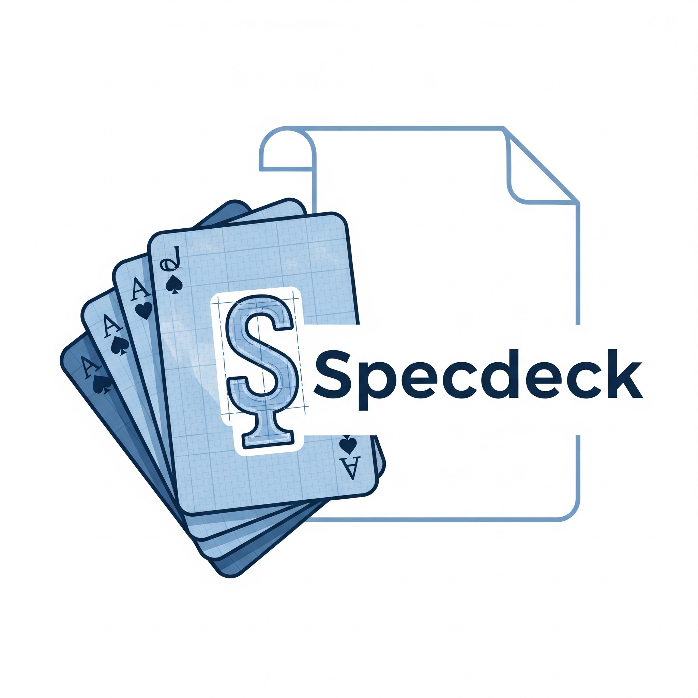

# specdeck


Specdeck: "デッキ"を組むように書ける仕様管理
Specdeckへようこそ。
このプロジェクトは、アプリケーションやWebサイトの仕様を、カードゲームのデッキを構築するような感覚で、体系的かつ効率的に管理するための仕組みです。

コンセプト
デッキ (Deck): アプリケーション全体像を示す「基本設計書」です。プロジェクトの目的、機能一覧（カードリスト）、データモデル（ER図）などを記述します。

カード (Card): 個別の画面や機能を示す「詳細設計書」です。カードごとにフォルダが作られ、仕様書本体や関連資料（UIデザイン画像など）をまとめて管理します。

ワークフロー
デッキを定義 (基本設計)
docs/DECK.md を開き、アプリケーションの全体像と、必要となる画面（カード）をすべて洗い出します。

カードの雛形を自動生成
ターミナルで以下のコマンドを実行すると、DECK.mdに記載されたカード一覧に基づいて、必要なフォルダと index.md ファイルの雛形が自動的に生成されます。

python scripts/create_cards.py

カードを作成 (詳細設計)
自動生成された各カードの index.md に、画面ごとの詳細な仕様を記述していきます。UIデザインのスクリーンショットなどの関連ファイルは、各カードのフォルダ内に格納してください。

レビューと実装
デッキとカードをチームでレビューし、承認されたものから実装を進めます。

フォルダ構成
```.
├── docs/
│   ├── cards/
│   │   # create_cards.py を実行すると、ここにカードフォルダが自動生成されます
│   │   # (例: CARD-001/, CARD-002/ ...)
│   │
│   ├── DECK.md          # 👈 まずはここから編集を始めます
│   └── PLAYBOOK.md      # プロジェクトの共通ルールを記述します
│
├── scripts/
│   ├── create_cards.py  # カード雛形を生成するスクリプト
│   └── generate_ddl.py  # ER図からSQLを生成するスクリプト
│
└── templates/
    └── SCREEN_CARD_TEMPLATE.md # カードのテンプレート
```

各スクリプトの使い方
カード雛形生成 (create_cards.py)
DECK.mdにカード一覧を記述した後、python scripts/create_cards.py を実行するだけで、対応するフォルダとindex.mdが自動生成されます。

DDL生成 (generate_ddl.py)
DECK.mdにMermaid形式でER図を記述した後、python scripts/generate_ddl.py を実行すると、ER図からCREATE TABLE文（SQL）を生成し、output.sqlというファイル名で出力します。

生成AIへのプロンプト例
プロジェクトのコーディングをAIに依頼する際は、以下のプロンプトをベースに、プロジェクトフォルダ全体をコンテキストとして与えることを推奨します。

```
あなたは優秀なソフトウェアエンジニアです。
添付されたプロジェクトフォルダは「Specdeck」という手法で書かれた仕様書です。
以下のルールに従って、この仕様に基づいたアプリケーションのコードを生成してください。

# ルール

docs/DECK.md が全体の基本設計です。まずこれを読んで、アプリケーションの全体像を理解してください。

docs/cards/ フォルダ内に、各画面の詳細設計が「カード」として格納されています。

DECK.md の「カード一覧」セクションに記載されているすべてのカードを実装してください。

各カードの実装内容は、対応するカードフォルダ内の index.md に記載されています。

データモデルは DECK.md のER図に従ってください。

docs/PLAYBOOK.md にプロジェクト固有のルールが記載されている場合は、それに従ってください。

# 生成するコードの仕様

言語・フレームワーク: (例: Python, Flask)

スタイル: (例: クリーンアーキテクチャに従う)

その他: (例: エラーハンドリングを丁寧に行う)
```
それでは、コード生成を開始してください。
