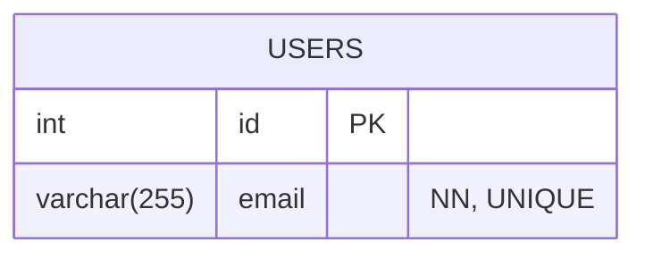

# 【Deck】(プロジェクト名) マスター仕様書

## 1. プロジェクト概要

このアプリケーションは、(アプリケーションの目的や解決する課題を記述)を目的としたWebアプリケーションです。

## 2. カード一覧 (画面・機能一覧)

このアプリケーションは、以下のカード（画面）で構成されます。

* `CARD-001`: (例: ログイン画面)

## 3. データモデル (ER図)

