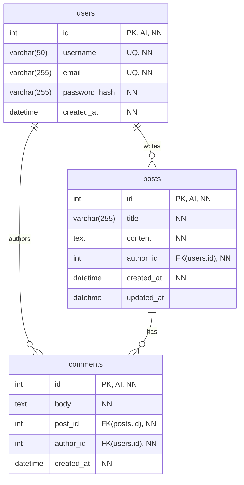

```mermaid
erDiagram
    users {
        int id "PK, AI, NN"
        varchar(50) username "UQ, NN"
        varchar(255) email "UQ, NN"
        varchar(255) password_hash "NN"
        datetime created_at "NN"
    }

    posts {
        int id "PK, AI, NN"
        varchar(255) title "NN"
        text content "NN"
        int author_id "FK(users.id), NN"
        datetime created_at "NN"
        datetime updated_at
    }

    comments {
        int id "PK, AI, NN"
        text body "NN"
        int post_id "FK(posts.id), NN"
        int author_id "FK(users.id), NN"
        datetime created_at "NN"
    }

    users ||--o{ posts : "writes"
    users ||--o{ comments : "authors"
    posts ||--o{ comments : "has"
```
